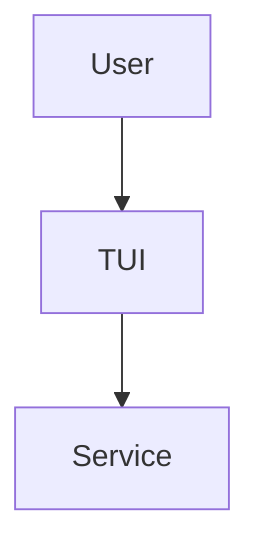

# Documentation Style Guide

**Version**: 1.0
**Last Updated**: 2025-11-20
**Status**: Active
**Authority**: Content & Communication Manifesto

This style guide ensures consistency across all tui-story documentation. All documentation must adhere to these standards.

## Table of Contents

1. [Voice and Tone](#voice-and-tone)
2. [Grammar and Mechanics](#grammar-and-mechanics)
3. [Terminology](#terminology)
4. [Formatting](#formatting)
5. [Code Examples](#code-examples)
6. [Structure](#structure)
7. [Accessibility](#accessibility)
8. [Tools and Linting](#tools-and-linting)

---

## Voice and Tone

### Person
- **Use**: Second person ("you")
- **Avoid**: First person ("we", "I") or third person ("the user")

```markdown
✅ You can analyze relationships by pressing 'a'
❌ We provide relationship analysis
❌ The user can analyze relationships
```

### Tense
- **Use**: Present tense
- **Avoid**: Future tense

```markdown
✅ The system validates input
❌ The system will validate input
```

### Mood
- **Instructions**: Imperative mood
- **Explanations**: Indicative mood

```markdown
✅ Press 'a' to analyze (imperative)
✅ The analysis takes 5-30 seconds (indicative)
❌ You should press 'a' to analyze (too tentative)
```

### Tone Principles
- **Professional**: Maintain technical accuracy
- **Helpful**: Anticipate user questions
- **Respectful**: Never condescending or dismissive
- **Concise**: Remove unnecessary words

**Avoid**:
- "Obviously", "simply", "just", "clearly" (assumes reader knowledge)
- "As you know", "of course" (condescending)
- Exclamation marks (except in warnings)
- Humor, puns, or clever wordplay that obscures meaning

---

## Grammar and Mechanics

### Active Voice
Prefer active voice over passive voice.

```markdown
✅ The system processes requests
❌ Requests are processed by the system

✅ You configure the API key via environment variable
❌ The API key is configured via environment variable
```

**Exception**: Passive voice acceptable when actor is unknown or irrelevant.

```markdown
✅ The graph is rendered in the terminal (actor irrelevant)
```

### Sentence Length
- **Target**: 15-20 words average
- **Maximum**: 30 words
- **Variation**: Mix short and long sentences for readability

### Paragraph Length
- **Target**: 3-5 sentences
- **Maximum**: 7 sentences
- Use lists for longer content

### Readability
- **Target**: Hemingway grade level ≤ 10 for general docs
- **Technical docs**: Grade level 12-14 acceptable
- Test at: [hemingwayapp.com](http://www.hemingwayapp.com/)

---

## Terminology

### Consistency
Use the same term for the same concept throughout all documentation.

### Standard Terms

| **Use** | **Avoid** | **Context** |
|---------|-----------|-------------|
| API key | access token, auth key | Authentication |
| response time | latency, speed | Performance |
| relationship | link, connection, edge | Graph concepts |
| vertex | node | Graph concepts |
| edge | link (when referring to relationship) | Graph concepts |
| analyze | process, compute | User action |
| TUI | terminal UI, terminal interface | Application type |
| deprecated | legacy, old | Version status |
| LLM | AI, language model | External service |

### Project-Specific Terms

**RelationType**: Always capitalize when referring to the enum:
```markdown
✅ The `RelationType` enum defines 9 semantic relationships
❌ The relationtype enum...
```

**Graph terminology**:
- **Vertex**: An idea/concept node
- **Edge**: A relationship between vertices
- **SemanticGraph**: The complete data structure

### Abbreviations
Spell out on first use, then abbreviate:

```markdown
✅ Large Language Model (LLM)... The LLM analyzes...
❌ LLM... (no first definition)
```

**Exception**: Well-known abbreviations (API, TUI, CLI, HTTP)

### Numbers
- **0-9**: Spell out ("three servers")
- **10+**: Use numerals ("42 requests")
- **Technical contexts**: Always numerals ("3ms", "5GB", "8 ideas")
- **Start of sentence**: Always spell out

```markdown
✅ The system handles 100 requests per second
✅ Three configuration options are available
❌ 3 configuration options are available
```

---

## Formatting

### Headings

**Semantic hierarchy**:
- H1: Page title (once per document)
- H2: Major sections
- H3: Subsections
- H4: Rare, only if necessary

**Style**: Sentence case (not Title Case)

```markdown
✅ ## Installation and setup
❌ ## Installation And Setup
❌ ## INSTALLATION AND SETUP
```

**Exception**: Proper nouns and acronyms retain capitalization:
```markdown
✅ ## Using the Anthropic API
```

### Emphasis

| **Purpose** | **Markdown** | **HTML** | **Example** |
|-------------|-------------|----------|-------------|
| Importance | `**bold**` | `<strong>` | **Required** |
| Stress | `*italic*` | `<em>` | *not* recommended |
| Code | `` `code` `` | `<code>` | `main.zig` |
| Keyboard | `<kbd>` | `<kbd>` | <kbd>Ctrl</kbd>+<kbd>C</kbd> |

**Avoid**:
- `<b>` or `<i>` tags (use semantic equivalents)
- ALL CAPS for emphasis (use bold)
- Excessive bolding (dilutes impact)

### Lists

**Unordered** (`<ul>`): Use when order doesn't matter
```markdown
- Feature A
- Feature B
- Feature C
```

**Ordered** (`<ol>`): Use for sequential steps
```markdown
1. Install Zig
2. Clone repository
3. Build project
```

**Parallel structure**: Items in a list should have consistent grammatical form
```markdown
✅
- Install dependencies
- Build the project
- Run tests

❌
- Install dependencies
- Building the project
- Tests should be run
```

### Links

**Inline links**: Use descriptive text, not "click here"

```markdown
✅ See [Architecture Decision Records](./docs/architecture/) for design rationale
❌ Click [here](./docs/architecture/) for ADRs
❌ For ADRs, see: ./docs/architecture/
```

**Reference-style links**: Use for repeated URLs

```markdown
The [Zig documentation][zig-docs] explains memory management.
More details in the [Zig documentation][zig-docs].

[zig-docs]: https://ziglang.org/documentation/master/
```

### Code

**Inline code**: Use for:
- Function names: `calculateLayout()`
- Variables: `vertex_id`
- File paths: `src/main.zig`
- Short commands: `zig build`
- Enum values: `RelationType.CONTRADICTORY`

**Code blocks**: Use for:
- Multi-line code examples
- Commands with output
- Configuration files

**Syntax highlighting**: Always specify language

````markdown
✅
```zig
const x: i32 = 42;
```

❌
```
const x: i32 = 42;
```
````

**File paths**: Use forward slashes (`/`) even on Windows

```markdown
✅ src/graph.zig
❌ src\graph.zig
```

---

## Code Examples

### Requirements
All code examples must:
1. **Execute successfully**: Test before documenting
2. **Be complete**: Include necessary imports
3. **Be idiomatic**: Follow Zig style conventions
4. **Include context**: Explain what the code does

### Format

````markdown
To add a vertex to the graph:

```zig
const std = @import("std");
const graph = @import("graph.zig");

pub fn main() !void {
    var gpa = std.heap.GeneralPurposeAllocator(.{}){};
    defer _ = gpa.deinit();
    const allocator = gpa.allocator();

    var g = graph.SemanticGraph.init(allocator);
    defer g.deinit();

    const vertex_id = try g.addVertex("Democracy", 0);
    std.debug.print("Added vertex {d}\n", .{vertex_id});
}
```

This creates a vertex with the label "Democracy" in group 0.
````

### Comments in Code

**Use comments to explain**:
- Why (not what)
- Non-obvious logic
- Security considerations
- Performance implications

```zig
✅
// Validate UTF-8 to prevent encoding attacks
if (!std.unicode.utf8ValidateSlice(input)) {
    return error.InvalidUtf8;
}

❌
// Check if input is valid UTF-8
if (!std.unicode.utf8ValidateSlice(input)) {
```

### Placeholders

Use `<angle_brackets>` for user-supplied values:

```bash
export ANTHROPIC_API_KEY=<your-api-key>
```

---

## Structure

### Document Structure

Standard order:
1. **Title** (H1)
2. **Metadata** (Last updated, version, status)
3. **Overview** (1-2 paragraphs)
4. **Table of contents** (if >3 sections)
5. **Sections** (H2+)
6. **References** (links to related docs)

### Front Matter

Add YAML front matter to all documentation:

```yaml
---
title: "Architecture Decision Records"
description: "Design decisions for tui-story project"
tags: [architecture, adr, design]
last_updated: 2025-11-20
version: 1.0
---
```

### Progressive Disclosure

Structure content from simple to complex:

1. **Level 1**: Quick start (5 minutes)
2. **Level 2**: Common tasks (30 minutes)
3. **Level 3**: Advanced usage (2+ hours)
4. **Level 4**: Reference (comprehensive)

Use collapsible sections (`<details>`) for optional content:

```markdown
<details>
<summary>Advanced: Customizing force-directed parameters</summary>

Edit `src/graph.zig` and modify the constants...
</details>
```

---

## Accessibility

### Alt Text
Provide descriptive alt text for all images and diagrams:

```markdown
![System architecture diagram showing client, TUI, service layer, domain layer, and LLM API with directional arrows indicating data flow]
(./diagrams/system-context.png)
```

### Mermaid Diagrams
Include text description after diagrams:

````markdown


**Description**: The user interacts with the TUI, which delegates to the service layer for business logic.
````

### Color Contrast
- Avoid relying solely on color to convey information
- Use shapes, labels, and patterns in addition to colors
- Test contrast ratios: 4.5:1 for text, 3:1 for UI components

### Link Text
Links should make sense out of context:

```markdown
✅ Read the [installation guide](./INSTALL.md)
❌ Read more [here](./INSTALL.md)
```

---

## Tools and Linting

### Markdown Linting

Use `markdownlint` with configuration:

```yaml
# .markdownlint.json
{
  "default": true,
  "MD013": { "line_length": 120 },
  "MD033": false,
  "MD041": false
}
```

Run:
```bash
markdownlint '**/*.md'
```

### Prose Linting

Use [Vale](https://vale.sh/) for prose style checking:

```yaml
# .vale.ini
StylesPath = .vale/styles
MinAlertLevel = suggestion

[*.md]
BasedOnStyles = write-good, alex
```

Install:
```bash
brew install vale  # macOS
# or
wget https://github.com/errata-ai/vale/releases/download/...
```

Run:
```bash
vale docs/
```

### Spell Checking

Use `codespell` to catch typos:

```bash
pip install codespell
codespell docs/ README.md CHANGELOG.md
```

### Link Checking

Use `markdown-link-check` to verify links:

```bash
npm install -g markdown-link-check
markdown-link-check README.md
```

---

## Examples

### Good Documentation

```markdown
## Installing Zig

You need Zig 0.13.0 or later to build tui-story.

### Download Zig

Visit [ziglang.org/download](https://ziglang.org/download/) and download Zig 0.13.0 for your platform:

- **Linux**: `zig-linux-x86_64-0.13.0.tar.xz`
- **macOS**: `zig-macos-x86_64-0.13.0.tar.xz`
- **Windows**: `zig-windows-x86_64-0.13.0.zip`

### Extract and Configure

1. Extract the archive:
   ```bash
   tar -xf zig-linux-x86_64-0.13.0.tar.xz
   ```

2. Add to PATH:
   ```bash
   export PATH="$PWD/zig-linux-x86_64-0.13.0:$PATH"
   ```

3. Verify installation:
   ```bash
   zig version
   ```

   Expected output: `0.13.0`

**Next steps**: [Build the project](./BUILD.md)
```

**Why this is good**:
- ✅ Clear, actionable steps
- ✅ Active voice ("You need", "Visit")
- ✅ Concrete examples with actual filenames
- ✅ Expected output shown
- ✅ Links to next steps

### Bad Documentation

```markdown
## Installation

The installation process is relatively straightforward and shouldn't take too long.
Simply download the appropriate version of Zig (we recommend 0.13.0 or later) from
the official Zig website, extract it somewhere convenient, and add it to your PATH
environment variable. Obviously, you'll want to verify that everything is working
correctly by running the version command.

Once you've successfully installed Zig, you can proceed with building the project
using the standard build command.
```

**Why this is bad**:
- ❌ Passive voice ("The installation process is")
- ❌ Vague ("somewhere convenient", "relatively straightforward")
- ❌ Condescending ("Obviously", "simply")
- ❌ No concrete examples or commands
- ❌ Wall of text (not scannable)

---

## Enforcement

### Pull Request Requirements
All documentation changes must:
1. Pass `markdownlint` checks
2. Pass `vale` prose linting (warnings acceptable, errors not)
3. Pass `codespell` spell checking
4. Have working links (verified by CI)
5. Follow this style guide

### Review Checklist
Reviewers should verify:
- [ ] Consistent terminology
- [ ] Active voice used
- [ ] Code examples tested
- [ ] Links work
- [ ] Accessible (alt text, descriptions)
- [ ] No condescending language
- [ ] Hemingway grade ≤ 10 (general docs)

---

## Changelog

| Version | Date | Changes |
|---------|------|---------|
| 1.0 | 2025-11-20 | Initial style guide based on Content & Communication Manifesto |

---

## References

- [Content & Communication Manifesto](../MANIFESTO_CONTENT.md) - Foundational principles
- [Keep a Changelog](https://keepachangelog.com/) - Changelog format
- [Semantic Versioning](https://semver.org/) - Versioning scheme
- [Microsoft Writing Style Guide](https://learn.microsoft.com/en-us/style-guide/) - Industry reference
- [Google Developer Documentation Style Guide](https://developers.google.com/style) - Industry reference
- [Vale Documentation](https://vale.sh/) - Prose linting
- [Hemingway Editor](http://www.hemingwayapp.com/) - Readability testing

---

**Last Updated**: 2025-11-20
**Maintained By**: @larsbx
**Questions?**: Open an issue with label `documentation`
