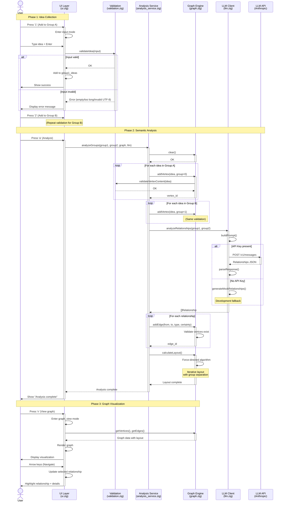
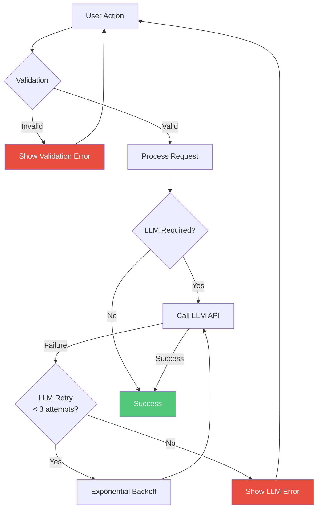
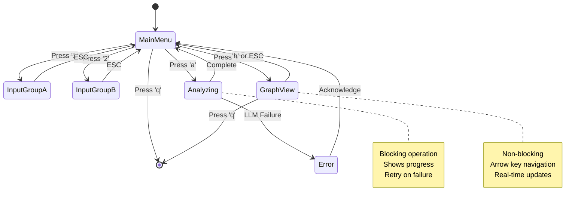
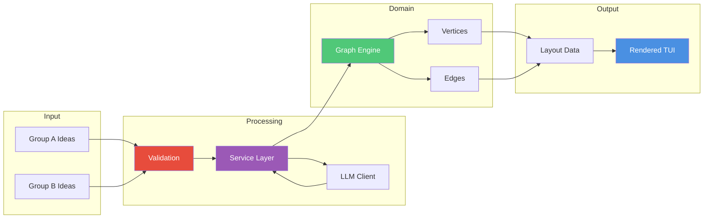

# Analysis Workflow Diagram

**Last Updated**: 2025-11-20
**Type**: Sequence Diagram
**Purpose**: Shows end-to-end flow of semantic relationship analysis

## Diagram

## Workflow Phases

### Phase 1: Idea Collection
**Duration**: 1-5 minutes
**User Actions**: Enter ideas for both groups
**System**: Validates input at boundary

**Validation checks**:
- Not empty
- ≤ 1000 characters
- Valid UTF-8 encoding
- Whitespace trimmed

See [ADR-004: Input Validation Layer](../ADR-004-input-validation-layer.md)

### Phase 2: Semantic Analysis
**Duration**: 5-30 seconds (LLM dependent)
**User Actions**: Trigger analysis
**System**: Multi-step orchestration

**Steps**:
1. **Clear graph**: Remove previous analysis
2. **Build vertices**: Add all ideas as nodes
3. **LLM analysis**: Identify relationships (with retry/timeout)
4. **Build edges**: Connect related ideas
5. **Calculate layout**: Position nodes visually

See [ADR-005: Service Layer Extraction](../ADR-005-service-layer-extraction.md)

### Phase 3: Graph Visualization
**Duration**: Until user exits
**User Actions**: Navigate relationships
**System**: Interactive rendering

**Features**:
- Arrow key navigation
- Relationship highlighting
- Certainty scores displayed
- Symbol legend

See [ADR-003: Force-Directed Graph Layout](../ADR-003-force-directed-graph-layout.md)

## Error Handling

**Resilience patterns**:
- Input validation prevents invalid data entering system
- LLM client retries with exponential backoff (1s, 2s, 4s)
- Timeout: 30 seconds per LLM call
- Graceful degradation: Mock data if API unavailable

See [ADR-002: Mock LLM Fallback](../ADR-002-mock-llm-fallback.md)

## Performance Characteristics

| Phase | Typical Duration | Bottleneck | Optimization |
|-------|------------------|------------|--------------|
| Idea Collection | 1-5 minutes | User input | N/A (human speed) |
| Validation | < 1ms | UTF-8 scan | Negligible overhead |
| Vertex Creation | < 10ms | Memory allocation | O(n) complexity |
| LLM Analysis | 5-30 seconds | Network + LLM processing | Caching, parallel requests |
| Edge Creation | < 10ms | Memory allocation | O(m) complexity |
| Layout Calculation | < 1 second | Force-directed iterations | Tested up to 100 nodes |
| Rendering | < 16ms | Terminal refresh rate | 60 FPS capable |

**Scalability**:
- Tested with 10×10 ideas (100 potential edges)
- Layout algorithm: O(n² × iterations)
- Memory: O(n + m) where n=vertices, m=edges

## State Transitions

## Data Flow

## References

- [System Context Diagram](./system-context.md) - High-level architecture
- [UI State Machine Diagram](./ui-state-machine.md) - Detailed UI states
- [Graph Layout Diagram](./graph-layout.md) - Layout algorithm details
- [ADR-005: Service Layer Extraction](../ADR-005-service-layer-extraction.md)
- [Integration Tests](../../tests/integration/workflow_test.zig) - Automated workflow tests

---

**Accessibility Note**: This diagram uses sequence numbering and clear labels. Each phase is explicitly marked with comments in the Mermaid source.
