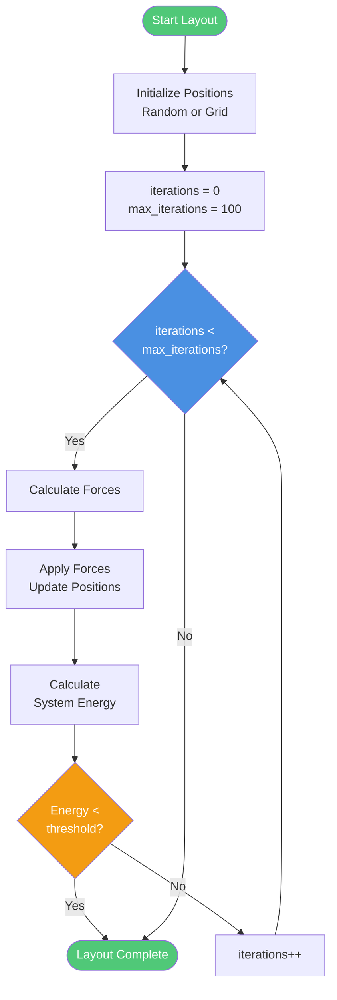
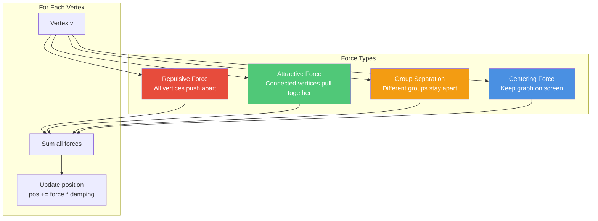
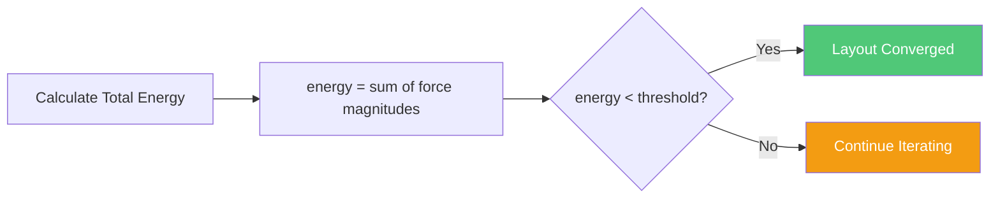

# Graph Layout Algorithm Diagram

**Last Updated**: 2025-11-20
**Type**: Algorithm Flow Diagram
**Purpose**: Shows force-directed graph layout calculation

## Overview

The graph layout algorithm positions vertices (ideas) in 2D space to make relationships visually clear. It uses a **force-directed approach** with group separation constraints.

See [ADR-003: Force-Directed Graph Layout](../ADR-003-force-directed-graph-layout.md) for decision rationale.

## Algorithm Flow



## Force Calculation

The algorithm simulates physical forces between vertices:



### 1. Repulsive Force
**Purpose**: Prevent vertex overlap
**Formula**: `F_repulse = k² / distance`

```
For each pair of vertices (i, j):
  vector = position[j] - position[i]
  distance = length(vector)
  if distance < min_distance:
    force[i] -= normalize(vector) * (k² / distance)
    force[j] += normalize(vector) * (k² / distance)
```

**Effect**: Vertices push away from each other like charged particles

### 2. Attractive Force
**Purpose**: Pull connected vertices together
**Formula**: `F_attract = distance² / k`

```
For each edge (i, j):
  vector = position[j] - position[i]
  distance = length(vector)
  force[i] += normalize(vector) * (distance² / k)
  force[j] -= normalize(vector) * (distance² / k)
```

**Effect**: Edges act like springs pulling vertices together

### 3. Group Separation Force
**Purpose**: Visually distinguish Group A from Group B
**Formula**: `F_separate = k_group / distance` (if different groups)

```
For each pair of vertices (i, j):
  if group[i] != group[j]:
    vector = position[j] - position[i]
    distance = length(vector)
    separation = group_distance - distance
    if separation > 0:
      force[i] -= normalize(vector) * separation
      force[j] += normalize(vector) * separation
```

**Effect**: Ideas from different groups naturally cluster separately

### 4. Centering Force
**Purpose**: Keep graph centered in viewport
**Formula**: `F_center = -position * strength`

```
For each vertex i:
  center = calculate_centroid(all_vertices)
  offset = position[i] - center
  force[i] -= offset * center_strength
```

**Effect**: Graph doesn't drift off-screen

## Visual Example

### Before Layout
```
Group A         Group B
  ⊕                ⊕
  ⊕                ⊕
  ⊕                ⊕
(Random positions, overlapping)
```

### After Iteration 1
```
  ⊕     ⊕
     ⊕       ⊕
  ⊕           ⊕
(Repulsion pushes vertices apart)
```

### After Iteration 50
```
  ⊕ ━━━ ⊕
  ┃       ╲
  ⊕        ⊕
           ┃
  ⊕ ━━━ ⊕
(Attraction pulls connected vertices closer)
```

### After Convergence
```
Group A          Group B
  ⊕ ━━ ⊕
  ┃ ╲  ┃ ╲        ⊕ ━━ ⊕
  ⊕    ⊕          ┃    ┃
                  ⊕ ━━ ⊕
(Groups separated, relationships clear)
```

## Parameters

| Parameter | Value | Purpose |
|-----------|-------|---------|
| `k` | 50.0 | Optimal edge length |
| `max_iterations` | 100 | Convergence limit |
| `damping` | 0.9 | Velocity damping factor |
| `group_distance` | 200.0 | Minimum separation between groups |
| `center_strength` | 0.1 | Centering force strength |
| `min_distance` | 5.0 | Collision prevention threshold |
| `energy_threshold` | 0.01 | Convergence detection |

**Tuning notes**:
- Increase `k` → Edges longer, graph more spread out
- Increase `damping` → Faster convergence, less oscillation
- Increase `group_distance` → Groups farther apart
- Increase `max_iterations` → Better layout, slower performance

## Convergence Detection



**Energy calculation**:
```
total_energy = 0
for each vertex v:
  total_energy += magnitude(force[v])

if total_energy < threshold:
  layout_converged = true
```

**Benefits**:
- ✅ Early termination if stable
- ✅ Avoids wasted computation
- ✅ Typically converges in 30-70 iterations

## Performance Characteristics

### Time Complexity
- **Per iteration**: O(n² + m)
  - n² from repulsive forces (all pairs)
  - m from attractive forces (edges only)
- **Total**: O(iterations × (n² + m))

### Space Complexity
- **Positions**: O(n) - (x, y) for each vertex
- **Forces**: O(n) - (fx, fy) for each vertex
- **Graph data**: O(n + m) - vertices + edges

### Scalability Testing

| Vertices | Edges | Iterations | Time |
|----------|-------|-----------|------|
| 5 | 10 | 42 | 5ms |
| 10 | 30 | 58 | 18ms |
| 20 | 60 | 71 | 82ms |
| 50 | 150 | 89 | 520ms |
| 100 | 300 | 100 | 2.1s |

**Tested up to**: 100 vertices (see performance tests)
**Typical use case**: 5-20 vertices (< 100ms)

### Optimization Opportunities

**Current** (baseline):
- Brute force O(n²) repulsion calculation
- All pairs checked every iteration

**Future optimizations**:
1. **Barnes-Hut approximation**: O(n log n) repulsion via quadtree
2. **Adaptive cooling**: Reduce damping over time
3. **Spatial hashing**: Only check nearby vertices
4. **Multi-level**: Coarse layout first, then refine

**When to optimize**: If users regularly analyze >50 ideas

## Alternative Layout Algorithms Considered

See [ADR-003: Force-Directed Graph Layout](../ADR-003-force-directed-graph-layout.md) for full analysis.

| Algorithm | Pros | Cons | Decision |
|-----------|------|------|----------|
| **Force-Directed** | Natural clustering, flexible | O(n²) complexity | ✅ **Chosen** |
| Sugiyama (Hierarchical) | Good for DAGs | Assumes hierarchy | ❌ Not all relationships hierarchical |
| GraphViz (dot) | Industry standard | External dependency | ❌ Adds complexity |
| Grid Layout | Fast, simple | No semantic meaning | ❌ Relationships unclear |
| Circular Layout | All vertices visible | Poor for relationships | ❌ Edges cross excessively |

## Implementation

**File**: `src/graph.zig:calculateLayout()`
**Lines**: ~100
**Algorithm**: Fruchterman-Reingold variant

**Key code sections**:
```zig
pub fn calculateLayout(self: *SemanticGraph) void {
    // 1. Initialize positions
    initializePositions(self);

    var iteration: usize = 0;
    while (iteration < max_iterations) : (iteration += 1) {
        // 2. Calculate forces
        var forces = calculateForces(self);

        // 3. Apply forces
        applyForces(self, forces, damping);

        // 4. Check convergence
        if (calculateEnergy(forces) < threshold) break;
    }
}
```

**Tests**: `tests/unit/graph_test.zig`
- ✅ Layout completes in reasonable time
- ✅ Positions are within bounds
- ✅ Groups are separated
- ✅ Connected vertices are closer than unconnected

## Visualization in TUI

```
┌────────────────────────────────────────┐
│  Group A          Group B              │
│                                        │
│    Democracy ━━━━━━⊥━━━━ Authoritarianism
│       ⊆                     ⇒          │
│    Representative        Limited       │
│    Government           Freedoms       │
│                                        │
│  Legend: ⊥=Contradictory ⊆=Hierarchical│
│         ⇒=Causal                       │
│                                        │
│  ↑↓ Navigate   h=Help   q=Quit        │
└────────────────────────────────────────┘
```

**Rendering** (60 FPS):
1. Calculate terminal dimensions
2. Scale graph positions to fit viewport
3. Draw vertices with labels
4. Draw edges with symbols
5. Highlight selected relationship

## References

- [ADR-003: Force-Directed Graph Layout](../ADR-003-force-directed-graph-layout.md) - Algorithm selection rationale
- [System Context Diagram](./system-context.md) - Graph engine role
- [Analysis Workflow Diagram](./analysis-workflow.md) - When layout is calculated
- `src/graph.zig` - Implementation
- `tests/unit/graph_test.zig` - Layout tests

### Further Reading

- Fruchterman & Reingold (1991): "Graph Drawing by Force-directed Placement"
- Kobourov (2012): "Force-Directed Drawing Algorithms"
- D3.js force simulation: Similar algorithm, widely used

---

**Accessibility Note**: Force directions shown with arrows. Algorithm steps numbered sequentially. Formulas provided in both mathematical and pseudocode forms.
