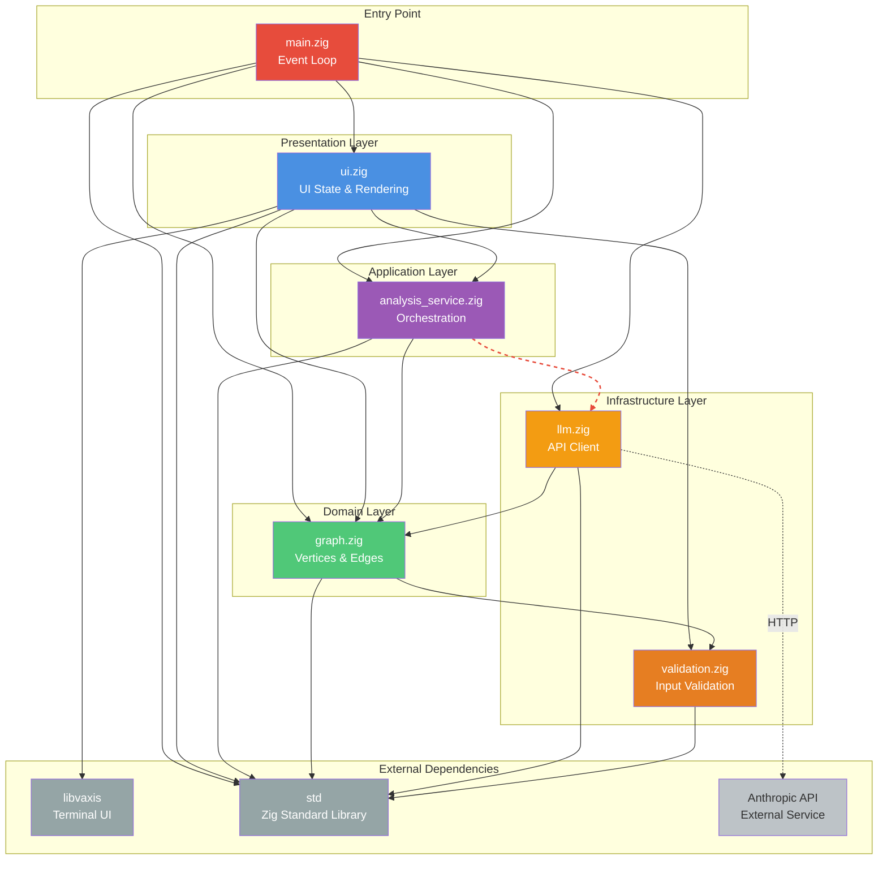

# Module Dependencies Diagram

**Last Updated**: 2025-11-20
**Type**: Dependency Graph
**Purpose**: Shows code module relationships and architectural constraints

## Diagram



## Layer Architecture

Following **Principle I: Architecture as Constraint System**, modules are organized in layers with strict dependency rules:

```
┌─────────────────────────────────────────┐
│         Entry Point (main.zig)          │
└─────────────────────────────────────────┘
                    ↓
┌─────────────────────────────────────────┐
│      Presentation Layer (ui.zig)        │ ← User interactions
└─────────────────────────────────────────┘
                    ↓
┌─────────────────────────────────────────┐
│  Application Layer (analysis_service)   │ ← Business orchestration
└─────────────────────────────────────────┘
                    ↓
┌─────────────────────────────────────────┐
│     Domain Layer (graph.zig)            │ ← Core business logic
└─────────────────────────────────────────┘
                    ↓
┌─────────────────────────────────────────┐
│  Infrastructure (llm.zig, validation)   │ ← External integrations
└─────────────────────────────────────────┘
```

### Dependency Rules

**✅ Allowed**:
- Outer layers depend on inner layers (unidirectional)
- Any layer depends on infrastructure (validation, LLM)
- Any layer depends on standard library

**❌ Prohibited**:
- Inner layers depend on outer layers (circular)
- Domain layer depends on presentation layer
- Infrastructure depends on application/domain logic

**Enforcement**:
- Zig's module system prevents circular imports (compile-time)
- Architecture tests verify boundaries (`tests/unit/architecture_test.zig`)

## Module Descriptions

### main.zig (Entry Point)
**Responsibility**: Application lifecycle and event loop
**Lines of Code**: ~150
**Dependencies**: All modules (composition root)

**Key functions**:
- `main()`: Initialize app, run event loop, cleanup
- Event dispatching to UI state handlers
- Memory leak detection on shutdown

**Architectural role**: Dependency injection container

### ui.zig (Presentation Layer)
**Responsibility**: User interface state and rendering
**Lines of Code**: ~400
**Dependencies**: analysis_service, graph, validation, libvaxis

**Key structures**:
- `UIState`: Current mode, idea lists, input buffers
- `UIMode`: Enum of application states
- Rendering functions for each mode

**Architectural role**: View + Controller (MVC)

**Extracted logic** (v0.3.0):
- Business orchestration moved to `analysis_service.zig`
- Now focuses purely on presentation

See [ADR-005: Service Layer Extraction](../ADR-005-service-layer-extraction.md)

### analysis_service.zig (Application Layer)
**Responsibility**: Business logic orchestration
**Lines of Code**: ~100
**Dependencies**: graph, llm

**Key functions**:
- `analyzeGroups()`: End-to-end analysis workflow
- Coordinates: graph building, LLM calls, edge creation
- Logging of analysis metrics

**Architectural role**: Service layer (Domain-Driven Design)

**Benefits**:
- ✅ UI doesn't contain business logic
- ✅ Service is testable without UI
- ✅ Reusable from CLI/API in future

See [ADR-005: Service Layer Extraction](../ADR-005-service-layer-extraction.md)

### graph.zig (Domain Layer)
**Responsibility**: Core graph data structures and algorithms
**Lines of Code**: ~350
**Dependencies**: validation, std

**Key structures**:
- `SemanticGraph`: Vertices and edges collections
- `Vertex`: Idea nodes with positions
- `Edge`: Relationships with types and certainty
- `RelationType`: 9 semantic relationship types

**Key algorithms**:
- Force-directed layout (see [graph-layout.md](./graph-layout.md))
- Vertex/edge management
- Layout calculation

**Architectural role**: Domain model (DDD)

**Domain invariants enforced**:
- Vertex content validated on creation
- Edge vertices must exist
- Relationship types are exhaustive enum
- Certainty scores in range [0.0, 1.0]

See [ADR-003: Force-Directed Graph Layout](../ADR-003-force-directed-graph-layout.md)

### llm.zig (Infrastructure Layer)
**Responsibility**: LLM API integration
**Lines of Code**: ~250
**Dependencies**: graph (Relationship type), std

**Key structures**:
- `LLMClient`: API client with configuration
- `Relationship`: Semantic relationship data
- `APIConfig`: Retry/timeout settings

**Key functions**:
- `analyzeRelationships()`: Send groups to LLM
- `buildPrompt()`: Construct analysis request
- `parseResponse()`: Extract relationships from JSON
- `generateMockRelationships()`: Development fallback

**Resilience patterns**:
- ✅ Retry with exponential backoff (3 attempts)
- ✅ Timeout: 30 seconds per call
- ✅ Mock fallback if no API key
- 🚧 Circuit breaker (foundation in place)

See [ADR-002: Mock LLM Fallback](../ADR-002-mock-llm-fallback.md)

### validation.zig (Infrastructure Layer)
**Responsibility**: Input validation and sanitization
**Lines of Code**: ~80
**Dependencies**: std only

**Key functions**:
- `validateIdea()`: User input validation
- `validateGroup()`: Group number validation
- `validateVertexContent()`: Domain validation
- `sanitizeInput()`: Whitespace trimming

**Validation rules**:
- Not empty
- ≤ 1000 characters
- Valid UTF-8 encoding
- No malicious input patterns

**Security benefits**:
- ✅ DoS prevention (length limit)
- ✅ Encoding attack prevention (UTF-8 check)
- ✅ Defense in depth (multiple layers)

**Zero external dependencies**: Pure validation logic

See [ADR-004: Input Validation Layer](../ADR-004-input-validation-layer.md)

## Architectural Constraints

### Constraint 1: Acyclic Dependencies
**Rule**: Dependency graph must be a DAG (Directed Acyclic Graph)
**Enforcement**: Zig compiler (circular imports fail compilation)
**Test**: `tests/unit/architecture_test.zig::test "acyclic dependencies"`

**Verified by**:
```zig
// This would fail to compile:
// main.zig imports ui.zig
// ui.zig imports main.zig ❌ Circular!
```

### Constraint 2: Validation at Boundaries
**Rule**: All external input validated at entry points
**Enforcement**: Architecture tests
**Test**: `tests/unit/architecture_test.zig::test "graph validates at domain boundary"`

**Verified by**:
```zig
// UI layer validates user input
try validation.validateIdea(user_input);

// Domain layer validates at boundary
try validation.validateVertexContent(content);
```

See [ADR-004: Input Validation Layer](../ADR-004-input-validation-layer.md)

### Constraint 3: Service Encapsulation
**Rule**: UI delegates business logic to service layer
**Enforcement**: Code review, architecture tests
**Test**: `tests/unit/architecture_test.zig::test "UI delegates to service layer"`

**Before** (❌ Mixed concerns):
```zig
// ui.zig had 40+ lines of business logic
fn analyzeIdeas(self: *UIState) !void {
    // Build vertices, call LLM, add edges... ❌
}
```

**After** (✅ Separation):
```zig
// ui.zig focuses on presentation
fn analyzeIdeas(self: *UIState) !void {
    try self.analysis.analyzeGroups(...); ✅
}
```

See [ADR-005: Service Layer Extraction](../ADR-005-service-layer-extraction.md)

### Constraint 4: No Domain Dependencies on Infrastructure
**Rule**: Domain layer (graph) doesn't depend on infrastructure (LLM)
**Enforcement**: Dependency Inversion Principle
**Test**: Manual verification (graph.zig has no LLM import)

**Current**:
- ✅ `graph.zig` only imports `validation.zig` and `std`
- ✅ `llm.zig` imports `graph.zig` (infrastructure → domain allowed)
- ✅ Dependencies point inward

### Constraint 5: Infrastructure Independence
**Rule**: Validation layer has zero external dependencies
**Enforcement**: Import restrictions
**Test**: `tests/unit/architecture_test.zig::test "validation has no external dependencies"`

**Verified by**:
```zig
// validation.zig
const std = @import("std"); // ✅ Only stdlib
// NO imports of graph, llm, ui, etc.
```

**Benefits**:
- Reusable across projects
- Easy to audit for security
- No version conflicts

## Test Coverage by Module

| Module | Unit Tests | Integration Tests | Coverage |
|--------|-----------|-------------------|----------|
| main.zig | 0 | 7 | Workflow tests |
| ui.zig | 15 | 7 | State management |
| analysis_service.zig | 5 (in integration) | 7 | Orchestration |
| graph.zig | 21 | 7 | Data structures |
| llm.zig | 16 | 7 | API client |
| validation.zig | 10 (in architecture) | 7 | Boundary checks |

**Total**: 67+ tests across all modules

See:
- `tests/unit/` - Module-specific tests
- `tests/integration/workflow_test.zig` - Cross-module tests
- `tests/unit/architecture_test.zig` - Constraint verification

## Future Architectural Evolution

### Planned (v0.4.0)
- **Real LLM integration**: Replace mock with HTTP client
- **Circuit breaker**: Complete resilience pattern in LLM client
- **Metrics collection**: RED metrics (Rate, Errors, Duration)

### Considered (Future)
- **Plugin architecture**: Support multiple LLM providers
- **Persistence layer**: Save/load analyses
- **API layer**: Expose as HTTP service
- **CLI mode**: Non-interactive analysis

### Constraints for Future Changes
When adding new modules, maintain:
1. ✅ Unidirectional dependencies (outer → inner)
2. ✅ Validation at all boundaries
3. ✅ Separation of concerns (presentation vs. business logic)
4. ✅ Testability (unit + integration tests)
5. ✅ Architecture tests for new constraints

## References

- [System Context Diagram](./system-context.md) - External view
- [Analysis Workflow Diagram](./analysis-workflow.md) - Runtime behavior
- [UI State Machine](./ui-state-machine.md) - UI layer details
- [Architecture Tests](../../tests/unit/architecture_test.zig) - Automated constraint verification
- [ADR-005: Service Layer Extraction](../ADR-005-service-layer-extraction.md) - Layer separation rationale

---

**Accessibility Note**: Layers are shown top-to-bottom (standard convention). Solid arrows = compile-time dependencies. Dashed arrows = runtime/network dependencies.
