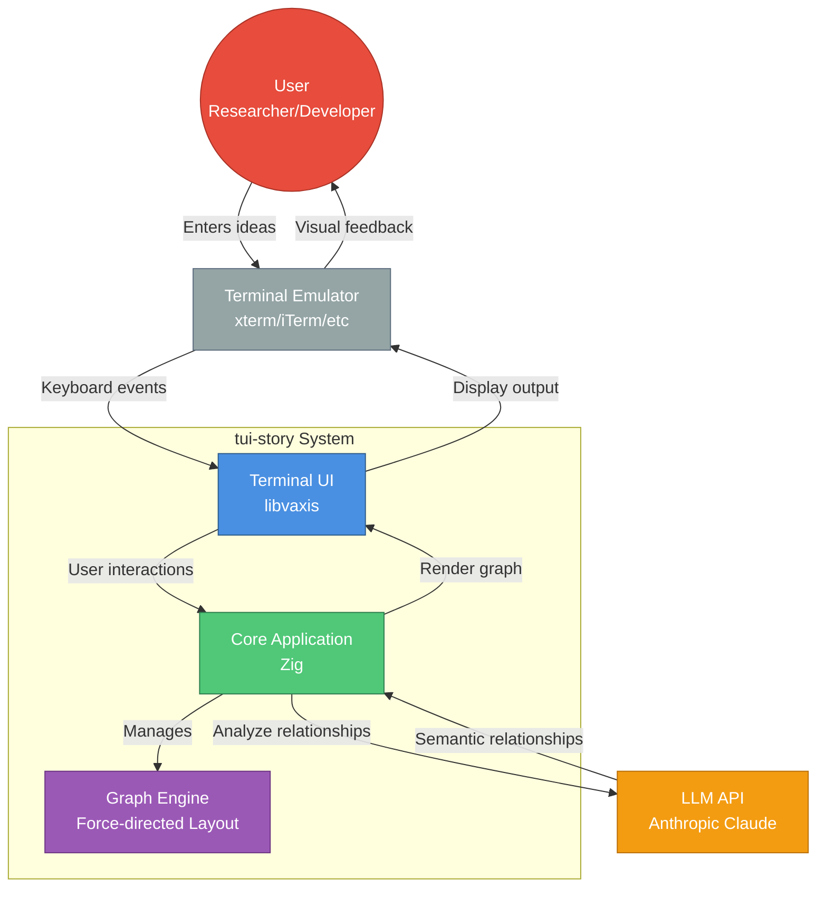
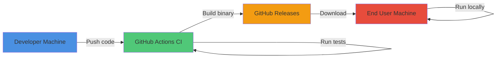
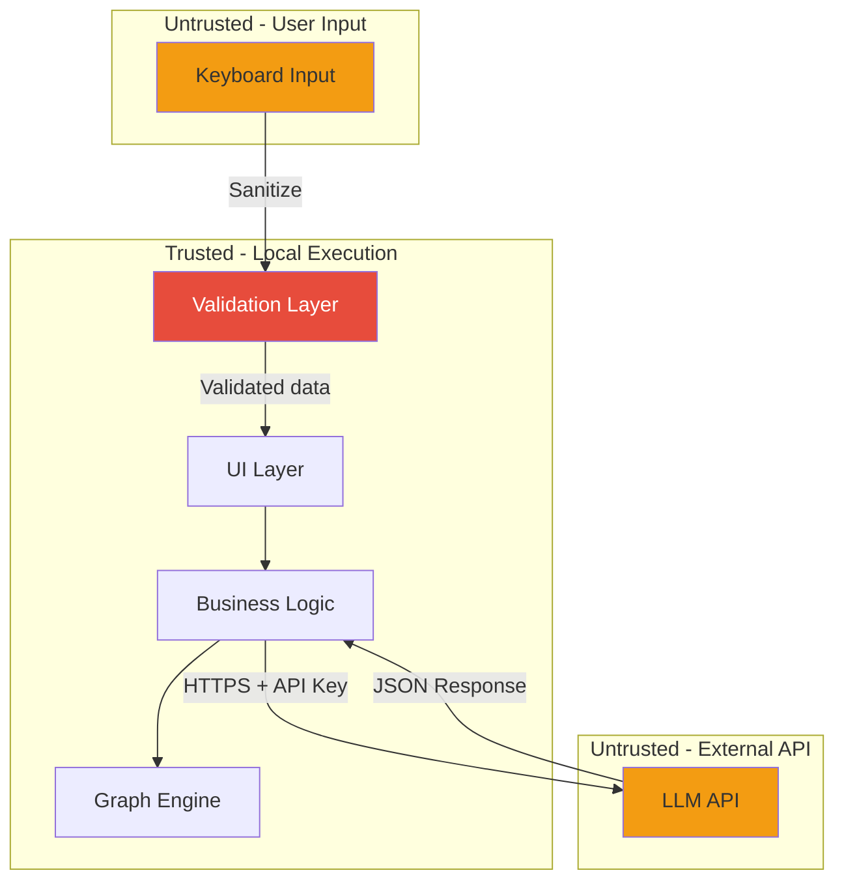

# System Context Diagram

**Last Updated**: 2025-11-20
**Type**: C4 Context Diagram
**Purpose**: Shows tui-story system boundaries and external dependencies

## Diagram

## Description

**tui-story** is a terminal-based application for analyzing semantic relationships between groups of ideas using LLMs.

### External Actors

- **User**: Researchers, developers, or students exploring concept relationships
- **Terminal Emulator**: Any modern terminal with Unicode support (xterm, iTerm2, Windows Terminal, etc.)
- **LLM API**: Anthropic Claude API for semantic analysis (optional - falls back to mock data)

### System Components

- **Terminal UI (libvaxis)**: Handles terminal rendering, input events, and visual display
- **Core Application**: Main event loop, orchestration, state management
- **Graph Engine**: Manages vertices (ideas), edges (relationships), and force-directed layout

### Key Interactions

1. User enters ideas via terminal → TUI captures input
2. TUI forwards to Core → Core adds to groups
3. User triggers analysis → Core sends to LLM API
4. LLM returns relationships → Core builds graph
5. Graph engine calculates layout → TUI renders visualization
6. User navigates graph → TUI updates display

## Technology Stack

| Component | Technology | Reason |
|-----------|-----------|---------|
| Language | Zig 0.13.0 | Memory safety, performance |
| TUI Library | libvaxis | Modern, feature-rich terminal UI |
| LLM Provider | Anthropic Claude | Semantic relationship understanding |
| Layout Algorithm | Force-directed | Natural clustering of related ideas |
| Build System | Zig build | Native build tooling |

## Deployment Context

**Distribution**: Binary releases via GitHub Releases
**Runtime**: Local execution (no server required)
**API Key**: Optional environment variable for LLM integration

## Design Principles

Following [ADR-001](../ADR-001-use-libvaxis-for-tui.md), libvaxis was chosen for:
- Modern terminal capabilities
- Event-driven architecture
- Strong Zig integration

Following [ADR-002](../ADR-002-mock-llm-fallback.md), LLM API is optional:
- Mock data enables development without API key
- Graceful degradation for demos

## Security Boundaries

**Trust boundaries**:
- User input validated at entry point (see [ADR-004](../ADR-004-input-validation-layer.md))
- LLM API responses parsed with error handling
- No persistent storage (all data in memory)

## References

- [ADR-001: Use libvaxis for TUI](../ADR-001-use-libvaxis-for-tui.md)
- [ADR-002: Mock LLM Fallback](../ADR-002-mock-llm-fallback.md)
- [ADR-004: Input Validation Layer](../ADR-004-input-validation-layer.md)
- [Analysis Workflow Diagram](./analysis-workflow.md)
- [Module Dependencies Diagram](./module-dependencies.md)

---

**Accessibility Note**: This diagram uses both colors and labels to distinguish components. Shape-based distinction ensures accessibility for colorblind users.
