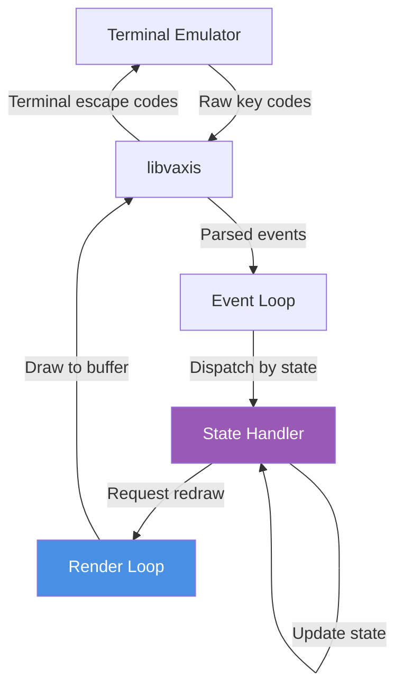

# UI State Machine Diagram

**Last Updated**: 2025-11-20
**Type**: State Machine Diagram
**Purpose**: Shows TUI navigation states and transitions

## Diagram

```mermaid
stateDiagram-v2
    [*] --> MainMenu: Application Start

    state MainMenu {
        [*] --> Idle
        Idle --> Idle: Render menu
        note right of Idle
            Display Options:
            1 - Add Group A ideas
            2 - Add Group B ideas
            a - Analyze relationships
            v - View graph
            r - Reset
            q - Quit
        end note
    }

    MainMenu --> InputGroupA: Press '1'
    MainMenu --> InputGroupB: Press '2'
    MainMenu --> Analyzing: Press 'a'
    MainMenu --> GraphView: Press 'v'
    MainMenu --> Reset: Press 'r'
    MainMenu --> [*]: Press 'q' (Quit)

    state InputGroupA {
        [*] --> EnteringText
        EnteringText --> EnteringText: Type characters
        EnteringText --> Validating: Press Enter
        Validating --> ShowError: Validation failed
        Validating --> AddedIdea: Validation passed
        ShowError --> EnteringText: Display error
        AddedIdea --> EnteringText: Ready for next
        note right of Validating
            Checks:
            - Not empty
            - <= 1000 chars
            - Valid UTF-8
        end note
    }

    state InputGroupB {
        [*] --> EnteringTextB
        EnteringTextB --> EnteringTextB: Type characters
        EnteringTextB --> ValidatingB: Press Enter
        ValidatingB --> ShowErrorB: Validation failed
        ValidatingB --> AddedIdeaB: Validation passed
        ShowErrorB --> EnteringTextB: Display error
        AddedIdeaB --> EnteringTextB: Ready for next
    }

    InputGroupA --> MainMenu: Press ESC
    InputGroupB --> MainMenu: Press ESC

    state Analyzing {
        [*] --> ClearGraph
        ClearGraph --> BuildVertices
        BuildVertices --> CallLLM
        CallLLM --> ParseResponse
        CallLLM --> Retry: API Error
        Retry --> CallLLM: Backoff (1s, 2s, 4s)
        Retry --> Failed: Max retries exceeded
        ParseResponse --> BuildEdges
        BuildEdges --> CalculateLayout
        CalculateLayout --> Complete
        Failed --> MainMenu: Show error
        note right of CallLLM
            Resilience:
            - 3 retry attempts
            - Exponential backoff
            - 30s timeout per attempt
            - Mock fallback if no API key
        end note
    }

    Analyzing --> MainMenu: Complete or Failed

    state GraphView {
        [*] --> Rendering
        Rendering --> Rendering: Render graph
        Rendering --> NavigatingUp: Press ↑
        Rendering --> NavigatingDown: Press ↓
        NavigatingUp --> Rendering: Update selection
        NavigatingDown --> Rendering: Update selection
        note right of Rendering
            Display:
            - Vertices with labels
            - Edges with symbols
            - Selected relationship details
            - Certainty score
            - Navigation hints
        end note
    }

    GraphView --> MainMenu: Press 'h' or ESC
    GraphView --> [*]: Press 'q' (Quit)

    state Reset {
        [*] --> ConfirmReset
        ConfirmReset --> ClearingData: User confirms
        ConfirmReset --> MainMenu: User cancels
        ClearingData --> MainMenu: Data cleared
    }

    state ErrorHandling {
        [*] --> DisplayError
        DisplayError --> LogError
        LogError --> [*]
        note right of ErrorHandling
            Errors logged with scope:
            - ui (UI layer)
            - semantic_graph (main)
            - llm (LLM client)
            - analysis_service (orchestration)
        end note
    }

    MainMenu --> ErrorHandling: Any error
    InputGroupA --> ErrorHandling: System error
    InputGroupB --> ErrorHandling: System error
    Analyzing --> ErrorHandling: System error
    GraphView --> ErrorHandling: System error
    ErrorHandling --> MainMenu: Error handled
```

## State Descriptions

### MainMenu
**Purpose**: Primary navigation hub
**Duration**: Until user selects action
**Data**: Current idea counts for both groups

**Available actions**:
- `1`: Enter Group A input mode
- `2`: Enter Group B input mode
- `a`: Start analysis (requires ideas in both groups)
- `v`: View graph (requires completed analysis)
- `r`: Reset all data (confirmation required)
- `q`: Quit application

**Validation**:
- Analysis disabled if groups empty
- View disabled if no graph built

### InputGroupA / InputGroupB
**Purpose**: Collect user ideas for analysis
**Duration**: Until user exits (ESC)
**Data**: Text buffer for current input

**Input handling**:
- Printable characters: Append to buffer
- Backspace: Remove last character
- Enter: Submit idea (validates then clears buffer)
- ESC: Return to main menu

**Validation errors** (see `src/validation.zig`):
- Empty input: "Idea cannot be empty"
- Too long (>1000 chars): "Idea too long (max 1000 characters)"
- Invalid UTF-8: "Invalid UTF-8 encoding"

**UI feedback**:
- Success: Brief confirmation message
- Error: Red error text, buffer retained for editing

### Analyzing
**Purpose**: Orchestrate relationship analysis
**Duration**: 5-30 seconds (LLM dependent)
**Data**: Progress state, retry count

**Substates**:
1. **ClearGraph**: Remove previous analysis
2. **BuildVertices**: Add ideas as graph nodes
3. **CallLLM**: Request semantic analysis (with retries)
4. **ParseResponse**: Extract relationships from JSON
5. **BuildEdges**: Add relationships as graph edges
6. **CalculateLayout**: Position nodes for visualization

**Blocking operation**: User cannot interact during analysis
**Progress indication**: Status messages shown

**Error handling**:
- LLM timeout: Retry with exponential backoff
- Max retries exceeded: Return to menu with error
- Parsing error: Log and return to menu

### GraphView
**Purpose**: Interactive visualization of analysis results
**Duration**: Until user exits (ESC or 'h')
**Data**: Selected relationship index

**Navigation**:
- `↑`: Previous relationship
- `↓`: Next relationship
- Wraps around at boundaries

**Display components**:
1. **Graph area**: Vertices and edges with symbols
2. **Detail panel**: Selected relationship info
   - From vertex → To vertex
   - Relationship type + symbol
   - Certainty score (0.0 - 1.0)
   - Description/justification
3. **Legend**: Relationship type reference
4. **Help text**: Navigation instructions

**Rendering**:
- 60 FPS capable
- Real-time selection updates
- Color-coded by group (Group A vs. Group B)

### Reset
**Purpose**: Clear all data (confirmation required)
**Duration**: Instant
**Data**: None (discards all state)

**Confirmation required** to prevent accidental data loss

**Actions**:
- Clear group1_ideas
- Clear group2_ideas
- Clear graph (vertices + edges)
- Return to main menu

### ErrorHandling
**Purpose**: Centralized error display and logging
**Duration**: Until user acknowledges
**Data**: Error message, context

**Error types**:
- **Validation errors**: User input issues (displayed inline)
- **LLM errors**: API failures (displayed with retry info)
- **System errors**: Memory allocation, I/O failures (critical)

**Logging scopes** (see Principle VIII):
```zig
const log = std.log.scoped(.ui);
const log = std.log.scoped(.semantic_graph);
const log = std.log.scoped(.llm);
const log = std.log.scoped(.analysis_service);
```

## State Invariants

### Type-State Pattern
Each mode is represented by the `UIMode` enum in `src/ui.zig`:

```zig
pub const UIMode = enum {
    main_menu,
    input_group1,
    input_group2,
    graph_view,
};
```

**Invariants enforced**:
- Cannot view graph before analysis complete
- Cannot analyze with empty groups
- Input buffer only exists in input modes
- Graph selection only exists in graph_view mode

### Memory Safety
All state transitions maintain memory safety:
- Input buffers allocated on mode entry, freed on exit
- Graph data persists until reset or re-analysis
- No dangling pointers across state transitions

See integration tests: `tests/integration/workflow_test.zig`

## Performance Characteristics

| State | Entry Cost | Exit Cost | Memory | Blocking |
|-------|-----------|-----------|---------|----------|
| MainMenu | O(1) | O(1) | Constant | No |
| InputGroupA/B | O(1) | O(1) | O(buffer) | No |
| Analyzing | O(n) | O(1) | O(n+m) | Yes |
| GraphView | O(1) | O(1) | O(n+m) | No |
| Reset | O(n+m) | O(1) | Freed | No |

Where:
- n = number of vertices (ideas)
- m = number of edges (relationships)
- buffer = current input text length

## Keyboard Event Flow



**Event handling**:
1. Terminal sends raw key codes
2. libvaxis parses into key events
3. Main event loop receives events
4. Dispatches to current state's handler
5. Handler updates state and requests redraw
6. Render loop draws new state
7. libvaxis sends escape codes to terminal

**Latency**: < 16ms (60 FPS)

## References

- [System Context Diagram](./system-context.md) - Overall system architecture
- [Analysis Workflow Diagram](./analysis-workflow.md) - Detailed analysis flow
- [ADR-001: Use libvaxis for TUI](../ADR-001-use-libvaxis-for-tui.md) - TUI framework choice
- [ADR-005: Service Layer Extraction](../ADR-005-service-layer-extraction.md) - Separation of concerns
- `src/ui.zig` - UI state implementation
- `tests/unit/ui_test.zig` - State transition tests

---

**Accessibility Note**: State names are descriptive and self-explanatory. Transitions are labeled with triggering actions (key presses).
